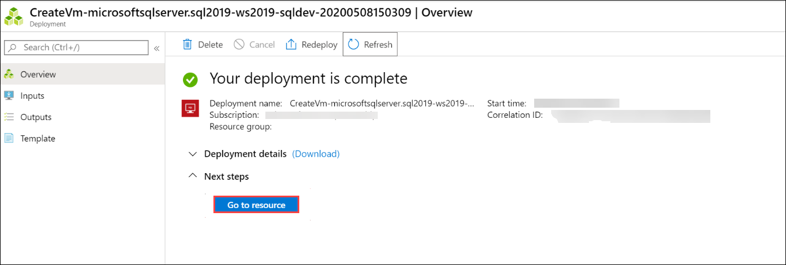
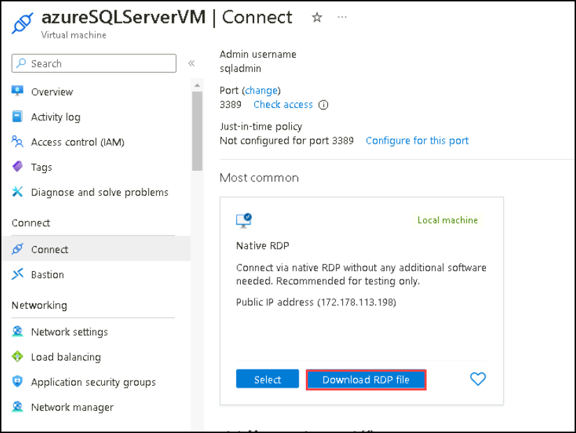

# Lab 01: Provision a SQL Server on an Azure Virtual Machine

## Lab scenario
Students will explore the Azure Portal and use it to create an Azure VM with SQL Server 2019 installed. Then they will connect to the virtual machine through Remote Desktop Protocol.

You are a database administrator for AdventureWorks. You need to create a test environment for use in a proof of concept. The proof of concept will use SQL Server on an Azure Virtual Machine and a backup of the AdventureWorksDW database. You need to set up the Virtual Machine, restore the database, and query it to ensure it is available.

## Lab objectives

In this lab, you will complete the following tasks:

- Task 1: Deploy a SQL Server on an Azure Virtual Machine
- Task 2: Connect to SQL Server on an Azure Virtual Machine

## Estimated timing: 30 minutes

## Architecture diagram

.png)

### Task 1 - Deploy a SQL Server on an Azure Virtual Machine

1. On the Azure portal locate the search bar at the top of the page. Search for **Azure SQL (1)**. Select the search result for **Azure SQL (2)** that appears in the results under **Services**.

    

1. On the **Azure SQL** blade, select **Create**.

    

1. On the **Select SQL deployment option** blade, click on the drop-down box under **SQL virtual machines(1)**. Select the option labeled **Free SQL Server License: SQL 2019 Developer on Windows Server 2022(2)**. Then select **Create**.

    

1. On the **Create a virtual machine** page, enter the following information and click **Next:Disks>**

    - **Subscription:** Use existing subscription 
    - **Resource group:** contoso-rg-<inject key="DeploymentID" enableCopy="false"/>
    - **Virtual machine name:**  azureSQLServerVM
    - **Region:** <inject key="location" enableCopy="false" />
    - **Availability Options:** No infrastructure redundancy required
    - **Security Type**: Standard
    - **Image:** Free SQL Server License: SQL 2019 Developer on Windows Server 2022 - Gen1
    - **Run with Azure spot instance:** No (unchecked)
    - **Size:** Standard *D2s_v3* (2 vCPUs, 8 GiB memory). You may need to select the **"See all sizes"** link to see this option)
    - **Administrator account username:** sqladmin
    - **Administrator account password:** pwd!DP300lab01
    - **Confirm password:** pwd!DP300lab01
    - **Select inbound ports:** RDP (3389)
    - **Would you like to use an existing Windows Server license?:** No (unchecked)

    Make note of the username and password for later use.

    

1. Review the configuration on **Disks** tab, **Networking** tab  and navigate to  **Next:Management>** 

1. On the **Management (1)** tab and review the configuration and Verify that **Enable auto_shutdown (2)** is unchecked, click **Next:Monitoring> (3)**

    
    
1. Review the configuration on  **Monitoring** tab, **Advanced** tab and  **SQL Server settings** tab 
 
    >**Note**: you can also configure the storage for your SQL Server VM on this screen. By default, the SQL Server Azure VM templates create one premium disk with read caching for data, one premium disk without caching for transaction log, and uses the local SSD (D:\ on Windows) for tempdb.

1. Select the **Review + create** button. Then select **Create**.

1. On the deployment blade, wait until the deployment is complete. The VM will take approximate 5-10 minutes to deploy. After the deployment is complete, select  **Go to resource**.

    >**Note:** Your deployment may take 5-10 minutes to complete.

    
    
 1. On the **Overview** page for the virtual machine, explore the menu options for this resource to review what is available.

    
    
> **Congratulations** on completing the task! Now, it's time to validate it. Here are the steps:
- Click the Lab Validation tab located at the upper right corner of the lab guide section and navigate to the Lab Validation Page.
- Hit the Validate button for the corresponding task. If you receive a success message, you can proceed to the next task. 
- If not, carefully read the error message and retry the step, following the instructions in the lab guide.
- If you need any assistance, please contact us at labs-support@spektrasystems.com. We are available 24/7 to help you out.
  
### Task 2 - Connect to SQL Server on an Azure Virtual Machine

1. On the **Overview** page for the virtual machine, select the **Connect** button.

1. On the RDP tab, select the **Download RDP File** button.

    

    >**Note**: If you see the error **Port prerequisite not met**. Make sure to select the link to add an inbound network security group rule with the destination port mentioned in the *Port number* field.

    

1. Open the RDP file that was just downloaded. When a dialog appears asking if you want to connect, select **Connect**.

    

1. Enter the username and password selected during the virtual machine provisioning process. Then select **OK**.

    

1. When the **Remote Desktop Connection** dialog appears asking if you want to connect, select **Yes**.

    

1. Inside the Virtual Machine, Select the Windows Start button and type **SSMS(1)**. Select **Microsoft SQL Server Management Studio 19(2)** from the list.  

   

1. When SSMS opens, notice that the **Connect to Server** dialog will be pre-populated with the default instance name. Select **Connect**.

    

>**Results:** In this exercise, you've seen how the Azure portal gives you powerful tools to manage a SQL Server hosted in a virtual machine. These tools include control over automated patching, automated backups, and giving you an easy way to setup high availability.

### Review

In this lab, you have completed:

- Deployed a SQL Server on an Azure Virtual Machine
- Connected to SQL Server on an Azure Virtual Machine

### You have successfully completed the lab.
